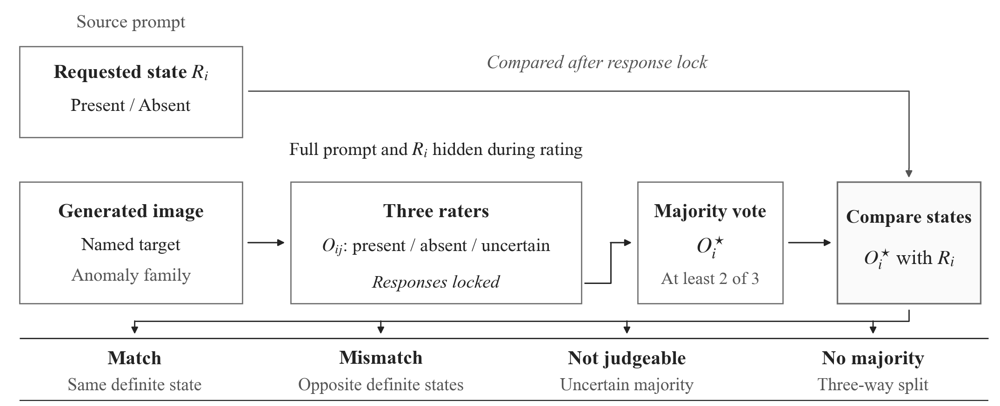

# A Prompt Is Not Ground Truth
### Human Validation of Local Target States in Generated Images

**CAC 2026 · Accepted paper · Paper ID 124973**

Haorui Yu · Hanwen Chen · **Qiufeng Yi***

University of Dundee · Shenyang University of Technology · University of Birmingham

[Analysis & data](cac2026/) · [Poster (PDF)](cac2026/poster/CAC2026_Poster_124973.pdf) · [Reproduce](#reproduce-the-cac-results) · [Cite](#citation)

A prompt records what a person wants an AI system to generate. Does the generated image actually contain the requested local target? We examine this question with **200 images, eight target families and three human raters**. The original locked judgments confirmed **174** requested states, contradicted **15**, and left **11 unresolved**.



## What this study establishes

Raters inspected the image, the named target and the anomaly family. The full prompt and requested state were hidden at response time. Majority judgments were then compared with the design-assigned requested state. Uncertain majorities and three-way splits remain in the all-sample denominator.

| Locked primary result | Count | Rate |
| :--- | ---: | ---: |
| Requested state confirmed | 174 / 200 | 87.0% |
| Requested state contradicted | 15 / 200 | 7.5% |
| Unresolved | 11 / 200 | 5.5% |
| Confirmed among definite majorities | 174 / 189 | 92.1% |

The 11 unresolved items comprise five uncertain majorities and six three-way splits. Inter-rater agreement was Fleiss' κ = 0.675 and Gwet AC1 = 0.757. Twelve post-return R2 changes are included separately as a sensitivity analysis; they do not replace the locked primary results.

The resulting human reference separates a visible mismatch from unresolved image evidence. It can support subsequent assessment of AI image judgments. **This study does not test AI-judge accuracy or whether corrective feedback makes later outputs more controllable.**

## Reproduce the CAC results

Python 3.9 or newer; standard library only. Once the `cac2026/` folder is available, reproduction uses no network, images, API keys or paid model calls.

```bash
cd cac2026
python reproduce_public.py --output reproduction_check.json
```

The script validates all 200 item identities, recomputes the majority judgments and summary statistics, checks the stratified counts, and verifies the 12 sensitivity changes. A disagreement with the archived analysis raises an error.

[Download the analysis-only ZIP](cac2026/cac2026-analysis.zip) for the eight small analysis files, then run the command above from its extracted folder.

See the [analysis README](cac2026/README.md) for file definitions, statistical scope and provenance. The [release manifest](cac2026/release_manifest.json) records the files copied from the camera-ready analysis package.

## Scope of the release

The CAC collection contains 120 target-present requests and 80 target-absent controls, with 25 images per family. All three raters were paper authors. Hiding the prompt at response time does not establish absence of prior familiarity or a causal benefit of that procedure.

The rates describe this diagnostic collection. Per-family estimates are descriptive, and no stable back-end generator identifier or complete selection log is available. The analysis files support numerical reproduction; **the full CAC image collection and generation prompts are not distributed here**, so this release is not an independent revalidation of image content or historical annotation procedures. A public overview figure and the poster illustrate the study.

## Two studies in this repository

| Study | Evaluation unit | Location |
| :--- | :--- | :--- |
| **CAC 2026: A Prompt Is Not Ground Truth** | 200 images; three human local-state judgments per image | [`cac2026/`](cac2026/) |
| Earlier prompt-permission study: *Not All Weirdness Is Hallucination* | 64 unique images; 144 prompt-image pairs | [Historical README](PRCV_README.md); existing root-level `data/`, `image/`, `prompts/`, `score/`, `scripts/` and `outputs/` |

These are distinct experiments. Their image IDs, labels, denominators and model results must not be combined. The repository retains its earlier name and files; only `cac2026/` supplies the CAC paper's analysis. Historical PRCV manuscripts and coordinator mappings are not CAC materials.

## Citation

The paper is accepted for CAC 2026. A proceedings DOI and page range are not available in this release; no arXiv citation is required.

```bibtex
@inproceedings{yu2026prompt,
  author    = {Yu, Haorui and Chen, Hanwen and Yi, Qiufeng},
  title     = {A Prompt Is Not Ground Truth: Human Validation of Local Target States in Generated Images},
  booktitle = {2026 Chinese Automation Congress (CAC)},
  year      = {2026},
  note      = {Accepted; Paper ID 124973}
}
```

Machine-readable citation: [CITATION.cff](CITATION.cff). For exact numerical reproduction, also record the Git commit used.

*Corresponding author:* Qiufeng Yi — qxy953@student.bham.ac.uk.

No repository-wide reuse license is declared. Please contact the authors for reuse permissions; institutional and conference marks remain the property of their respective owners.
